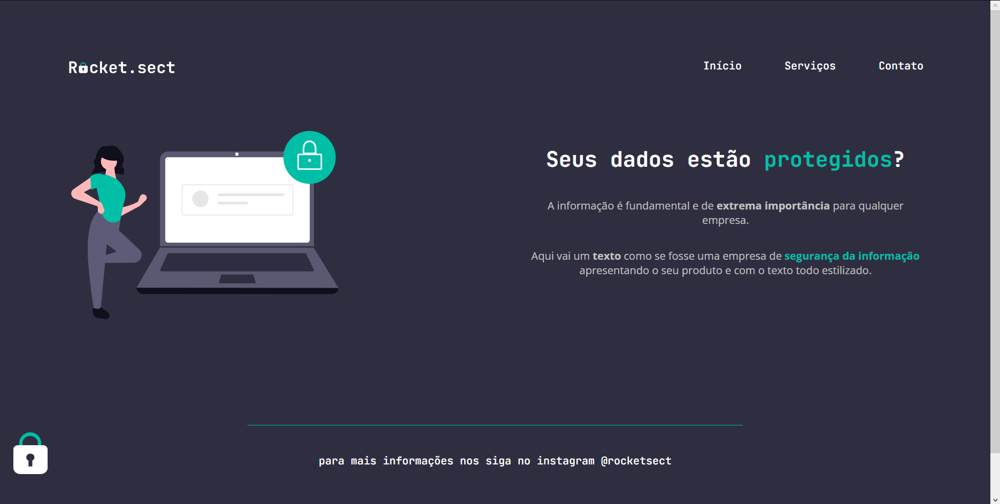

# Projeto 02

Projeto feito para recriar uma aplicação a partir de um layout do Figma, pra treinar conceitos de html e css vistos em uma aula da Rocketseat.

## Tecnologias
- HTML  
- CSS  
- Git

## Layout
Você pode visualizar o layout do projeto através [desse link](<https://www.figma.com/file/EdKjPWjC8ZlbnH4XzTObv2/Explorer/duplicate?type=design&node-id=0-1>).  
É necessário ter uma conta no [Figma](https://www.figma.com).
 

  

